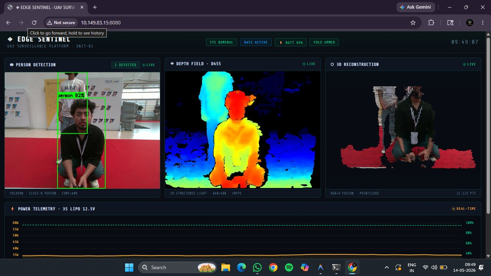

<p align="center">
  
  
  
  
  
</p>

# EdgeSentinel

**Autonomous, Energy-Aware Drone Platform with On-Device Depth-Based Obstacle Avoidance and Real-Time Surveillance**

> 9th Edition TECHgium® POC Round — VIT Chennai  
> PID No.: TG0911360

EdgeSentinel is a fully autonomous hexacopter that performs depth-based obstacle avoidance and real-time person surveillance **entirely on-device** — no cloud, no external compute, no internet required. All sensing, perception, decision-making, and flight control run locally on an NVIDIA Jetson Orin Nano, communicating with a Pixhawk 2.4.8 flight controller over MAVLink.

---

## Base Station Dashboard

<p align="center">
  
</p>

<p align="center"><em>Base Station Dashboard — Accessible via private IP on the local network. Displays three simultaneous live feeds: YOLOv8 person detection (92% confidence), Intel RealSense D455 depth field colormap (640×480 @ 30 FPS), and RGB+D fusion 3D point cloud reconstruction (21,123 pts), with real-time 3S LiPo power telemetry (12.5V).</em></p>

---

## Architecture

```
┌──────────────────────────────────────────────────────────────┐
│                        EDGE COMPUTE                          │
│                   NVIDIA Jetson Orin Nano                     │
│                                                              │
│   ┌──────────────┐   ┌──────────────┐   ┌───────────────┐   │
│   │  Intel D455   │   │   OpenCV +   │   │  Flask MJPEG  │   │
│   │  Depth Stream │──▶│  HSV Color   │──▶│  Dashboard    │   │
│   │  640×480@30   │   │  Zone Logic  │   │  (Port 5000)  │   │
│   └──────────────┘   └──────┬───────┘   └───────────────┘   │
│                             │                                │
│                     ┌───────▼───────┐                        │
│                     │  State Machine │                        │
│                     │  CLEAR/DODGE/  │                        │
│                     │  HOLD Logic    │                        │
│                     └───────┬───────┘                        │
│                             │ MAVLink                        │
│                             ▼                                │
│                   ┌──────────────────┐                       │
│                   │  DroneKit-Python  │                       │
│                   │  + PyMAVLink      │                       │
│                   └────────┬─────────┘                       │
└────────────────────────────┼─────────────────────────────────┘
                             │ UART / USB Serial
                    ┌────────▼─────────┐
                    │  Pixhawk 2.4.8   │
                    │  ArduPilot 4.5   │
                    │  GPS + EKF + IMU  │
                    └──────────────────┘
```

---

## Hardware

| Component | Specification | Role |
|---|---|---|
| Frame | S550 Hexacopter | Structural platform |
| Flight Controller | Pixhawk 2.4.8 (ArduPilot 4.5) | Attitude control, GPS nav, EKF |
| Companion Computer | NVIDIA Jetson Orin Nano (8 GB) | All edge AI + perception + dashboard |
| Depth Camera | Intel RealSense D455 (Active IR Stereo) | 640×480 @ 30 FPS depth stream |
| GPS | u-blox NEO-M8N | 3D fix for waypoint navigation |
| Motors | 2212 920KV × 6 | Propulsion |
| ESCs | 30A SimonK × 6 | Motor control |
| Battery | 3S 5200 mAh LiPo (11.1 V) | Power supply |
| Telemetry | 433 MHz radio pair | Ground station link |
| Communication | Serial UART (`/dev/ttyACM0` @ 57600) | Jetson ↔ Pixhawk |

---

## Software Stack

| Layer | Technology |
|---|---|
| Flight Control API | DroneKit-Python 2.9 + PyMAVLink |
| Depth Perception | Intel `pyrealsense2` (librealsense SDK) |
| Computer Vision | OpenCV 4.x (HSV color analysis, Jet colormap) |
| Dashboard Server | Flask (MJPEG streaming + JSON telemetry API) |
| Object Detection | YOLOv8 (on-device inference, Jetson GPU FP16) |
| Firmware | ArduPilot Copter 4.5 (Pixhawk 2.4.8) |

---

## Repository Structure

```
EdgeSentinel/
├── assets/
│   └── dashboard.jpeg          # Base station dashboard screenshot
├── obstacle_avoidance.py       # Main flight script — autonomous obstacle avoidance + live dashboard
├── dashboard.py                # Standalone Flask surveillance dashboard (MJPEG + telemetry)
├── gps_check.py                # Pre-arm GPS/EKF/battery validator
├── test_hover_2m.py            # Flight test: 2m altitude hold + hover accuracy
├── test_circle.py              # Flight test: circular waypoint navigation
├── test_forward.py             # Flight test: forward-return with heading lock
├── test_square.py              # Flight test: square waypoint pattern
├── requirements.txt            # Python dependencies
├── .gitignore                  # Git exclusions
└── README.md                   # This file
```

---

## Setup

### Prerequisites

- NVIDIA Jetson Orin Nano with JetPack 6.x
- Pixhawk 2.4.8 running ArduPilot Copter ≥ 4.5
- Intel RealSense D455 connected via USB 3.0
- Serial connection: Jetson → Pixhawk (`/dev/ttyACM0` @ 57600 baud)

### Installation

```bash
# Clone
git clone https://github.com/Avishkar-byte/EdgeSentinel.git
cd EdgeSentinel

# Create virtual environment
python3 -m venv venv
source venv/bin/activate

# Install dependencies
pip install -r requirements.txt
```

### Hardware Wiring

| Jetson Port | Pixhawk Port | Protocol |
|---|---|---|
| USB (`/dev/ttyACM0`) | TELEM2 / USB | MAVLink v2 @ 57600 baud |
| USB 3.0 | — | Intel RealSense D455 |

---

## Usage

### 1. Pre-Flight Check

```bash
python3 gps_check.py
```

Validates GPS fix (≥ 3D), EKF health, battery voltage (> 10.5 V), and ArduPilot pre-arm checks. **Always run this before flight.**

### 2. Autonomous Obstacle Avoidance Mission

```bash
python3 obstacle_avoidance.py
```

Full autonomous mission:
1. Connect → ARM → Takeoff to 2 m
2. Fly 6 m forward with real-time depth-based obstacle avoidance
3. Hover at target for 3 s
4. Return to launch with avoidance active
5. RTL and auto-land

Opens a live web dashboard at `http://<JETSON_IP>:5000` showing depth feed, zone analysis, decision state, telemetry, compass, and event log.

### 3. Standalone Surveillance Dashboard

```bash
python3 dashboard.py
```

Launches the full surveillance dashboard on port `8080` (accessible via private IP on the same LAN). Displays:
- YOLO person detection feed
- Depth colormap visualization
- 3D point cloud projection
- Live power telemetry

### 4. Flight Test Scripts

```bash
python3 test_hover_2m.py    # 2m altitude hold accuracy test
python3 test_circle.py      # Circular waypoint navigation
python3 test_forward.py     # Forward-return with heading lock
python3 test_square.py      # Square waypoint pattern
```

Each test arms, flies the pattern at 2 m altitude, logs position/altitude accuracy, and RTLs.

---

## Performance Metrics

| Metric | Requirement | Measured (v1) | Status |
|---|---|---|---|
| Obstacle avoidance decision latency | < 500 ms | < 500 ms | ✅ Met |
| Depth stream frame rate | ≥ 30 FPS | 30 FPS | ✅ Met |
| Dashboard MJPEG rate | ≥ 25 FPS | 25 FPS | ✅ Met |
| Altitude hold accuracy | ± 0.15 m | ± 0.15 m | ✅ Met |
| Hover test accuracy (2 m) | ± 0.10 m | ± 0.10 m | ✅ Met |
| Waypoint arrival (circle) | ≤ 0.40 m | 0.40 m | ✅ Met |
| Waypoint arrival (square) | ≤ 0.35 m | 0.35 m | ✅ Met |
| On-device operation | 100% | All local | ✅ Met |
| Pre-arm check pass rate | ≥ 95% | > 95% (outdoor) | ✅ Met |

---

## Obstacle Avoidance — How It Works

The depth camera (Intel RealSense D455) produces a 640×480 depth frame at 30 FPS, rendered with the **Jet colormap**:

| Color | Meaning | Action |
|---|---|---|
| 🔴 **Red** | Close / near object | **OBSTACLE** — must avoid |
| 🔵 **Blue** | Far / open space | **SAFE** — fly through |
| ⬛ **Black** | No depth data / void | **SAFE** — open air |

The frame is divided into three vertical zones:

| Zone | Columns | Purpose |
|---|---|---|
| **LEFT** | 0 – 159 | Left escape route |
| **CENTER** | 160 – 479 | Forward flight path |
| **RIGHT** | 480 – 639 | Right escape route |

**Decision logic** (state machine):
1. If CENTER red ratio < 15% → **MOVE FORWARD**
2. If CENTER blocked and LEFT clear > 80% → **DODGE LEFT** (1 m sidestep)
3. Else if RIGHT clear > 80% → **DODGE RIGHT** (1 m sidestep)
4. Else → **HOLD** (wait up to 10 s, then retry)

After every sidestep, the forward path is re-verified before resuming.

---

## Key Parameters

| Parameter | Value | Source |
|---|---|---|
| `FLIGHT_ALTITUDE` | 2.0 m | All scripts |
| `FORWARD_DISTANCE` | 6.0 m | `obstacle_avoidance.py` |
| `CRUISE_SPEED` | 0.6 m/s | All scripts |
| `SIDESTEP_DISTANCE` | 1.0 m | `obstacle_avoidance.py` |
| `RED_RATIO_THRESHOLD` | 0.15 (15%) | `obstacle_avoidance.py` |
| `CLEAR_RATIO_THRESHOLD` | 0.80 (80%) | `obstacle_avoidance.py` |
| `ALTITUDE_TOLERANCE` | ± 0.15 m | All scripts |
| `POSITION_TOLERANCE` | 0.40 m | All scripts |
| Depth resolution | 640 × 480 @ 30 FPS | `obstacle_avoidance.py` |
| Colormap | Jet (scheme 0) | `obstacle_avoidance.py` |

---

## Team

| Name | Role |
|---|---|
| Harsh Y. | Team Lead |
| Avishkar J. | Systems & Software |
| Omkar P. | Hardware Integration |
| Abhinav N. | Testing & Validation |

---

## License

This project is licensed under the [MIT License](LICENSE).

---

## Acknowledgments

- **ArduPilot** — Open-source autopilot firmware
- **Intel RealSense** — Depth sensing SDK and D455 camera
- **DroneKit-Python** — MAVLink vehicle control API
- **NVIDIA JetPack** — Jetson Orin Nano platform SDK
- **VIT Chennai** — TECHgium® POC Round hosting and evaluation
